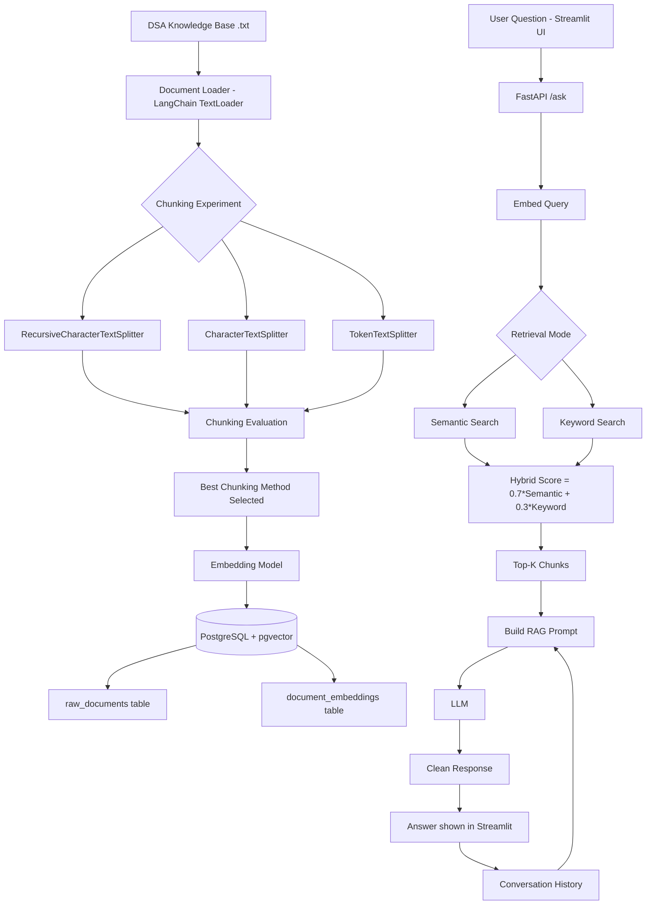
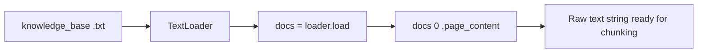
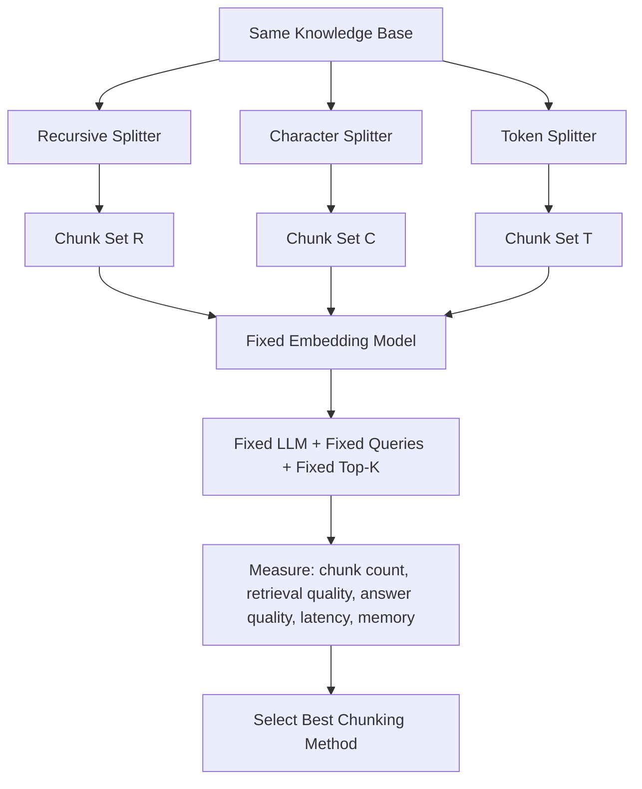
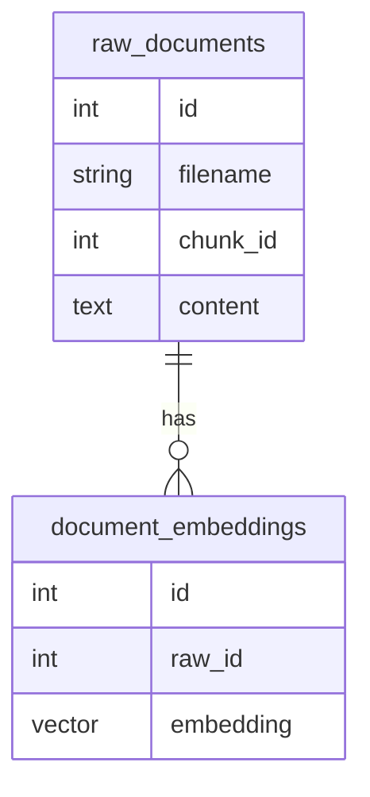
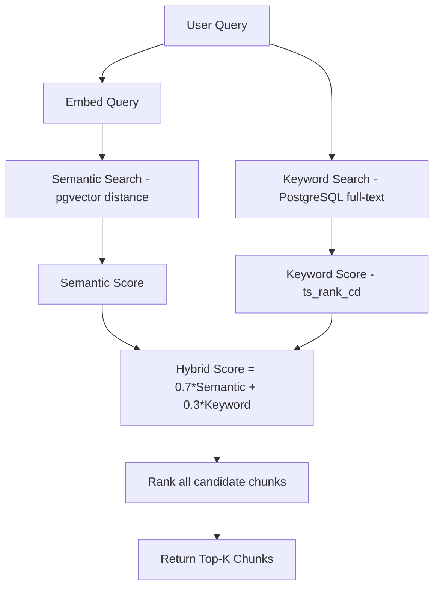
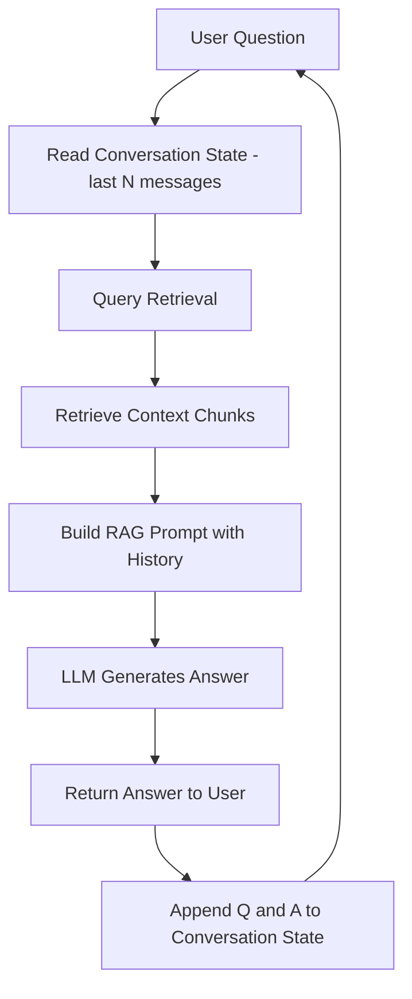
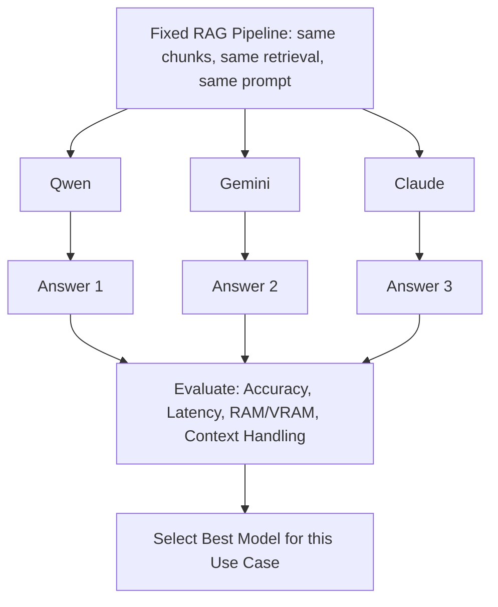
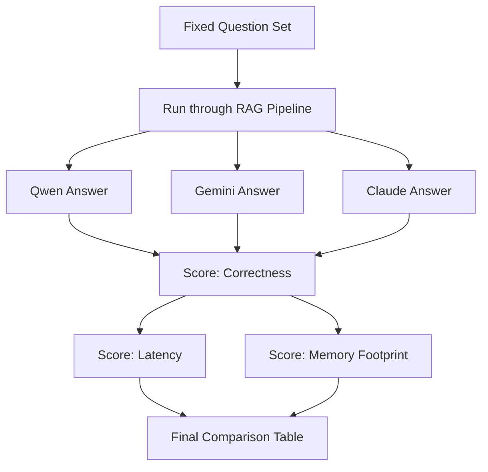
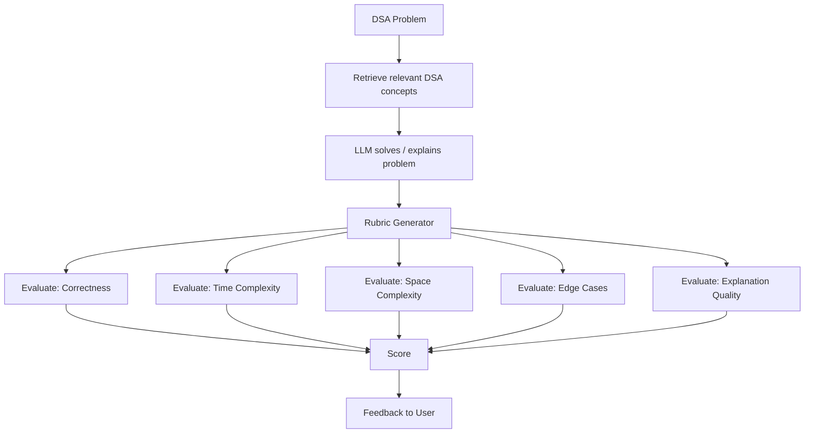

# DSA Coach - LLM Evaluation
## Implementation Report

---

## 1. Objective

Build a DSA-focused AI tutor that:

* accepts DSA questions/problems,
* retrieves relevant DSA knowledge using RAG,
* generates answers with an LLM,
* remembers conversation context,
* evaluates answers with a rubric,
* evaluates three chunking techniques,
* compares multiple LLMs,
* measures accuracy, latency, and memory,
* and later adds a controlled RAG/agent loop.

---

## 2. End-to-End Architecture



---

## 3. Technology Stack

| Layer | Technology | Purpose |
|---|---|---|
| Language | Python | Core implementation |
| Orchestration | LangChain | Document loading, chunking, embeddings interface |
| Backend API | FastAPI | Exposes `/ask` endpoint |
| Frontend | Streamlit | Chat UI, sidebar, history |
| Vector Store | PostgreSQL + pgvector | Stores chunks + embeddings, similarity search |
| Retrieval | pgvector distance + PostgreSQL full-text search | Semantic + keyword search |
| LLM (initial) | Small local Qwen model | Fits ~16GB RAM constraint |
| LLM (comparison) | Qwen / Gemini / Claude | Cross-model evaluation |

---

## 4. Knowledge Base

The knowledge base is organized as one detailed Markdown file per DSA topic, rather than a single flat text file:

```
knowledge_base/
├── arrays.md
├── backtracking.md
├── binary_search_tree.md
├── binary_search.md
├── dynamic_programming.md
├── graph.md
├── greedy_algorithms.md
├── hash_table.md
├── heap.md
├── linked_list.md
├── queue.md
├── recursion.md
├── sorting_algorithms.md
└── stack.md
```

Each topic file contains **detailed notes**, not a short summary — definitions, properties, common operations, complexity analysis, and worked examples for that topic.

In addition, each topic includes a set of **~20 practice questions spanning difficulty levels**:

* Easy
* Medium
* Hard
* Complex

This gives the retrieval and evaluation pipeline both conceptual notes (for "what is X" style questions) and problem-style questions (for testing retrieval + answer-generation + rubric evaluation across difficulty levels), rather than relying on a single small demo file.

---

## 5. Document Ingestion Pipeline



```python
from langchain_community.document_loaders import TextLoader

loader = TextLoader(filename, encoding="utf-8")
docs = loader.load()
text_content = docs[0].page_content
```

---

## 6. Chunking: Three Techniques Under Evaluation

The professor's requirement is explicit: **do not assume a chunking method is best — prove it.** All three are run on the same knowledge base and compared.

| Technique | Splitting Logic | Params Used |
|---|---|---|
| RecursiveCharacterTextSplitter | Tries to split on paragraph/sentence boundaries first | chunk_size=500, overlap=50 |
| CharacterTextSplitter | Splits on a fixed separator (`\n`) | chunk_size=500, overlap=50, separator="\n" |
| TokenTextSplitter | Splits by token count (via tiktoken) | chunk_size=256, overlap=20 |

```python
from langchain_text_splitters import (
    RecursiveCharacterTextSplitter,
    CharacterTextSplitter,
    TokenTextSplitter
)

def chunk_text(text):
    recursive_chunks = RecursiveCharacterTextSplitter(
        chunk_size=500, chunk_overlap=50
    ).split_text(text)

    char_chunks = CharacterTextSplitter(
        separator="\n", chunk_size=500, chunk_overlap=50
    ).split_text(text)

    token_chunks = TokenTextSplitter(
        chunk_size=256, chunk_overlap=20
    ).split_text(text)

    return {
        "recursive": recursive_chunks,
        "character": char_chunks,
        "token": token_chunks
    }
```

### 6.1 Chunking Evaluation Diagram



### 6.2 Evaluation Table Template

| Method | # Chunks | Avg Chunk Size | Retrieval Quality (P@K) | Answer Quality | Retrieval Time | Memory |
|---|---:|---:|---|---|---|---|
| Recursive | — | — | — | — | — | — |
| Character | — | — | — | — | — | — |
| Token | — | — | — | — | — | — |

> RecursiveCharacterTextSplitter is the current working candidate because it tends to preserve semantic boundaries, but it is only declared "best" after this table is filled with real measurements.

---

## 7. Embeddings

Every chunk (and later, every user query) is converted into a numeric vector so that semantic similarity can be computed mathematically.

```
Text chunk
    ↓
Embedding Model
    ↓
[0.023, -0.154, 0.827, ...]
```

```python
vector = embeddings.embed_query(chunk)
```

---

## 8. Storage — PostgreSQL + pgvector



`raw_id` in `document_embeddings` is a foreign key into `raw_documents`, keeping the text and its vector representation linked but separately queryable.

---

## 9. Retrieval Pipeline



### 9.1 Semantic Search

```python
query_vector = embeddings.embed_query(query)
```
```sql
SELECT * FROM document_embeddings
ORDER BY embedding <-> CAST(:q AS vector)
LIMIT :top_k;
```

### 9.2 Keyword Search

```sql
SELECT *,
       ts_rank_cd(to_tsvector('english', r.content),
                   plainto_tsquery('english', :query)) AS score
FROM raw_documents r
ORDER BY score DESC
LIMIT :top_k;
```

### 9.3 Hybrid Search

```
Hybrid Score = 0.7 × Semantic Score + 0.3 × Keyword Score
```

Semantic search understands meaning ("What stores data linearly?" → arrays); keyword search catches exact terminology ("binary search"); hybrid search combines both.

### 9.4 Top-K

Streamlit exposes a selectable Top-K (3 / 4 / 5), controlling how many chunks are pulled into the prompt context.

---

## 10. RAG Prompt Construction

The LLM never sees only the raw question. The model should receive:

```
System instructions
+
Retrieved context
+
Conversation history
+
Current question
```

**Prompt requirements:**

* Answer the current question directly.
* Do not mention the knowledge base.
* Do not dump retrieved chunks.
* Explain clearly.
* Use examples when useful.
* Include algorithm / code / complexity when appropriate.
* Use conversation history for follow-up questions.
* If required information is unavailable, say so.

Concretely, this is assembled as:

```
You are DSA Coach, a friendly and helpful Data Structures
and Algorithms tutor.

Use the provided knowledge to answer the user's question.

IMPORTANT:
- Answer the current question directly.
- Do not mention the knowledge base.
- Do not dump retrieved chunks.
- Explain clearly, with examples when useful.
- Include algorithm/code/complexity when appropriate.
- Use conversation history for follow-up questions.
- If required information is unavailable, say so.

KNOWLEDGE:
{context}

PREVIOUS CONVERSATION:
{conversation}

CURRENT QUESTION:
{query}
```

Retrieved chunks are **never shown directly to the user** — only the generated, synthesized answer is.

---

## 11. Conversational Memory Loop



Only the last ~10 messages are kept, to prevent unbounded prompt growth.

```python
history = [
    {"role": "user", "content": "What is an array?"},
    {"role": "assistant", "content": "An array is..."}
]
```

---

## 12. Backend — FastAPI

```python
class QuestionRequest(BaseModel):
    question: str
    mode: str = "semantic"
    top_k: int = 3
    history: list = []
```

`POST /ask`:

```
Request
 → Validate question
 → Choose semantic / hybrid retrieval
 → Retrieve chunks
 → Build context
 → Add conversation history
 → Call LLM
 → Return cleaned answer
```

Core function:

```python
def search_and_answer(query, mode="hybrid", top_k=5, history=None):
    if mode == "semantic":
        results = semantic_search(query, top_k)
    else:
        results = hybrid_search(query, top_k)

    context = "\n\n".join(row.content for row in results)
    conversation = build_history(history)
    prompt = build_prompt(context, conversation, query)
    response = llm.invoke(prompt)
    return clean_response(response)
```

### 12.1 Response Cleaning

LLM output isn't always a plain string, so it's normalized before returning to the frontend:

```python
if isinstance(response.content, str):
    answer = response.content
elif isinstance(response.content, list):
    parts = []
    for item in response.content:
        if isinstance(item, dict) and "text" in item:
            parts.append(item["text"])
        elif isinstance(item, str):
            parts.append(item)
    answer = "\n".join(parts)
else:
    answer = str(response.content)
```

---

## 13. Frontend — Streamlit

Chat-style UI with:
- Chat input / message bubbles
- New Chat button, with previous chats preserved in the sidebar
- Automatic chat naming
- Delete / clear conversation
- Retrieval mode selector (semantic / hybrid)
- Top-K selector
- Light purple theme, dark readable text, robot avatar

---

## 14. Model Strategy

**Rule:** get one model working end-to-end first — do not build a multi-model system prematurely.

Because the development machine has ~16GB RAM, a smaller **Qwen** model is the practical first choice for local generation: it fits comfortably in memory while still being capable enough to validate the full RAG pipeline. Once the pipeline itself is proven correct, alternative models (Gemini, Claude) are swapped in for comparison — the pipeline stays fixed, only the LLM changes.



---

## 15. Evaluation Methodology

### 15.1 Principle: Change One Variable at a Time

| Experiment | Fixed | Varied | Measures |
|---|---|---|---|
| A — Chunking | LLM, embeddings, queries, Top-K | Chunking method | Retrieval quality, answer quality, chunk count, latency, memory |
| B — LLM | Best chunking, embeddings, queries, Top-K, retrieval, prompt | LLM | Accuracy, latency, RAM/VRAM |
| C — Memory | Model, RAG pipeline | No history / short-term history / persistent memory | Follow-up-question accuracy |

### 15.2 Metrics

- **Retrieval Quality:** Precision@K, Recall@K, MRR (or manual "was the right chunk in Top-K?" check for a student project)
- **Answer Accuracy:** Correct / Partially Correct / Incorrect, against known-answer questions
- **Response Time:** retrieval time, LLM generation time, total time
- **Memory Usage:** RAM (and VRAM if applicable) — important given the 16GB constraint

### 15.3 Sample Evaluation Questions

```
What is the time complexity of accessing an array element by index?   → O(1)
What is the difference between a stack and a queue?
What is binary search, and what is its time complexity?
What data structure is used for BFS?
What is the average lookup complexity of a hash table?
Explain Two Sum.
```

### 15.4 Model Evaluation Pipeline



---

## 16. Worked Example —  Two Sum Problem

**Turn 1**

```
User: Explain Two Sum.
```

1. Query embedded → vector search + keyword search run in parallel
2. Hybrid score ranks chunks about arrays, hash tables, and the Two Sum pattern into Top-3
3. Prompt built: retrieved chunks + empty history + question
4. LLM answers:

```
Two Sum asks you to find two numbers in an array that add up to
a target value. The efficient approach uses a hash map: as you
scan the array, store each number's index, and check whether
(target - current number) has already been seen. This gives
O(n) time and O(n) space, compared to O(n²) for the brute-force
nested-loop approach.
```

5. `{question, answer}` appended to conversation state

**Turn 2 (follow-up, tests memory)**

```
User: What is its time complexity?
```

- "its" resolves to "Two Sum's hash-map approach" using the stored conversation history
- A fresh retrieval runs (query has changed), pulling complexity-related chunks
- LLM answers:

```
The hash-map approach to Two Sum runs in O(n) time, since each
element is processed once with O(1) average-case hash map
lookups and insertions.
```

This demonstrates the full loop: retrieval → grounded generation → memory-aware follow-up → retrieval again.

---

## 17. Future Work — Rubric-Based Evaluator / Agent Layer

Treated as a later layer, not part of the first working version:



Example rubric for Two Sum:

| Criterion | Result |
|---|---|
| Algorithm correctness | ✓ |
| Time complexity O(n) | ✓ |
| Space complexity O(n) | ✓ |
| Handles duplicates | ✓ |
| Explanation clarity | ✓ |

---

## 18. Project File Structure

```
DSA_coach_proj/
├── knowledge_base/
│   ├── arrays.md
│   ├── backtracking.md
│   ├── binary_search_tree.md
│   ├── binary_search.md
│   ├── dynamic_programming.md
│   ├── graph.md
│   ├── greedy_algorithms.md
│   ├── hash_table.md
│   ├── heap.md
│   ├── linked_list.md
│   ├── queue.md
│   ├── recursion.md
│   ├── sorting_algorithms.md
│   └── stack.md
├── chunking.py
├── document_loader.py
├── embeddings/model.py
├── retrieval.py
├── db.py
├── main.py                 # FastAPI app
├── streamlit_app.py        # Streamlit UI
├── evaluation/
│   ├── evaluate_chunking.py
│   ├── evaluate_retrieval.py
│   └── evaluate_models.py
└── README.md
```

---

## 19. One-Sentence Summary

DSA Coach is a conversational RAG system where DSA knowledge is loaded, chunked (via three competing strategies), embedded, and stored in PostgreSQL with pgvector; user questions are answered using semantic/hybrid retrieval plus conversation memory passed to an LLM, with the entire pipeline — chunking, retrieval mode, and model choice — evaluated experimentally rather than assumed.
