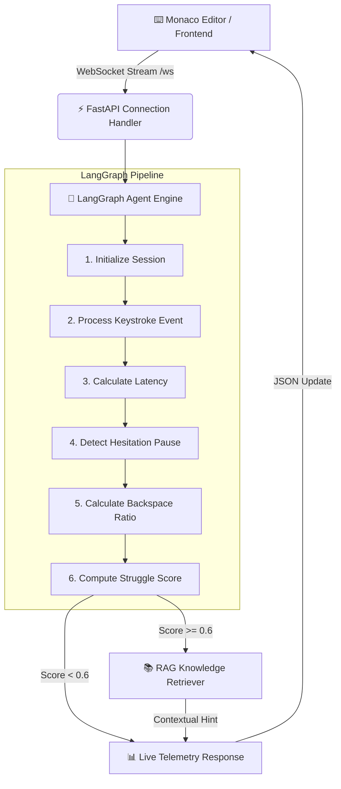

<div align="center">

# ⚡ AlgoFlow AI Engine & Keystroke Agent ⚡

### *Real-Time Cognitive Friction Detection & Adaptive RAG Guidance*


<p align="center">
  <a href="#-features">Features</a> •
  <a href="#%EF%B8%8F-interactive-architecture">Architecture</a> •
  <a href="#-quick-start">Quick Start</a> •
  <a href="#-telemetry--struggle-score-algorithm">Telemetry Engine</a> •
  <a href="#-testing">Testing</a>
</p>

---

</div>

## 📖 Overview

**AlgoFlow AI Engine** is a real-time developer copilot designed to passively monitor coding behavior and cognitive friction. Powered by **LangGraph** and **WebSockets**, it calculates a live **Struggle Score** (0.0 to 1.0) based on typing latency, backspace frequency, and hesitation pauses. 

When friction exceeds thresholds, an embedded **RAG (Retrieval-Augmented Generation)** knowledge engine contextually delivers targeted algorithmic guidance (Arrays, Graphs, DP, Trees) without spoiling full solutions.

---

## 🌟 Key Features

<table>
  <tr>
    <td width="50%">
      <h3>⚡ Real-Time Telemetry</h3>
      <p>Streams live editor events (<code>KEYPRESS</code>, <code>BACKSPACE</code>, <code>DELETE</code>, <code>PASTE</code>) over persistent WebSockets with sub-50ms processing latency.</p>
    </td>
    <td width="50%">
      <h3>🧠 LangGraph Agent Pipeline</h3>
      <p>Stateful graph workflow computing inter-keystroke timing, backspace ratios, and hesitation pause detection.</p>
    </td>
  </tr>
  <tr>
    <td width="50%">
      <h3>🎯 Adaptive RAG Guidance</h3>
      <p>Contextual vector search over embedded Markdown knowledge bases for Data Structures & Algorithms.</p>
    </td>
    <td width="50%">
      <h3>📊 Live Visual Dashboard</h3>
      <p>Interactive web dashboard visualizing live friction score gauges, pause indicators, and RAG hint alerts.</p>
    </td>
  </tr>
</table>

---

## 🛠️ Interactive Architecture



---

## 🚀 Quick Start

> [!IMPORTANT]
> Ensure **Python 3.10+** is installed before running the server.

### 1️⃣ Clone & Navigate
```bash
git clone https://github.com/nirmalyamohanty/key-stroke-agent.git
cd key-stroke-agent/algoflow/aiengineen
```

### 2️⃣ Install Dependencies
```bash
pip install -r app/requirements.txt
```

### 3️⃣ Start the FastAPI Backend
```bash
uvicorn app.main:app --reload --port 8000
```

### 4️⃣ Open Frontend Interface
Simply open `frontend/index.html` in your browser to launch the live telemetry workspace!

---

## 📊 Telemetry & Struggle Score Algorithm

<details>
<summary><b>🔍 Click to expand Struggle Score Calculation Details</b></summary>

<br/>

The **Struggle Score** is dynamically computed on every event using a weighted heuristic:

$$\text{Struggle Score} = \min(1.0, \, w_{\text{backspace}} + w_{\text{pause}} + w_{\text{latency}})$$

| Metric Parameter | Condition Threshold | Score Weight | Description |
| :--- | :--- | :---: | :--- |
| **Backspace Ratio** | $> 20\%$ of total keystrokes | **+0.4** | Frequent code deletions indicate uncertainty |
| **Pause Detected** | Latency $> 2.0\text{ seconds}$ | **+0.3** | Prolonged inactivity during coding |
| **High Inter-Key Latency** | Latency $> 1.0\text{ second}$ | **+0.3** | Slow hesitation between individual keypresses |

> [!TIP]
> When **Struggle Score $\ge 0.6$**, the RAG engine automatically activates to suggest relevant problem-solving techniques.

</details>

---

## 📚 Knowledge Base & RAG Coverage

<details>
<summary><b>📂 Click to view embedded Data Structures & Algorithms topics</b></summary>

<br/>

- 🧩 **Arrays**: Frequency Arrays, Kadane's Algorithm, Prefix Sums, Sliding Window, Two Pointers
- 🌲 **Trees & Graphs**: BFS, DFS, Dijkstra, Binary Search Trees, Topological Sort, Union-Find
- 💡 **Dynamic Programming**: Knapsack, LCS, LIS, Coin Change, Tabulation, Memoization
- 🔄 **Backtracking**: Subsets, Permutations, N-Queens, Sudoku Solver
- 📊 **Sorting & Searching**: Quick Sort, Merge Sort, Heap Sort, Binary Search

</details>

---

## 🧪 Testing

Execute the built-in test suites to verify LangGraph workflow execution and vector retrieval:

```bash
# Test Session State & Threshold Logic
python test_state.py

# Test RAG Vector Store & Embedder
python test_rag.py

# Test Full Retriever Pipeline
python test_retriever.py
```

---

## 👥 Presentation Outline

<details>
<summary><b>🎤 Click to view Pitch Deck Breakdown</b></summary>

<br/>

1. **Project Overview** (1 min): Real-time cognitive friction detection for coders.
2. **Problem & Why It Matters** (1 min): Eliminates silent frustration and maintains flow state.
3. **How We Solved It** (1.5 min): FastAPI + LangGraph + Adaptive RAG architecture.
4. **Results & What We Built** (2 min): Sub-50ms WebSocket telemetry engine & live dashboard.
5. **What We Learned** (1 min): Asynchronous state machines & specialized vector search.

</details>

---

<div align="center">
  <sub>Built with ❤️ for AI Agent research and developer learning experience.</sub>
</div>
