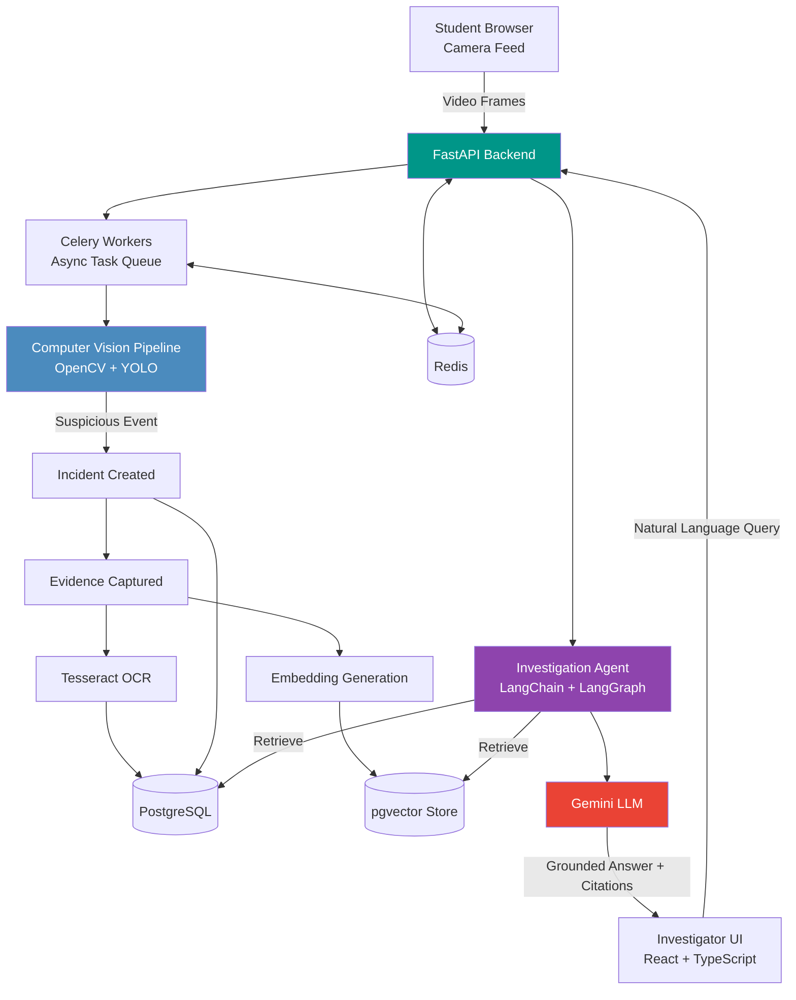

# 🎓 ProctorAI

### 🕵️ AI-Assisted Online Exam Proctoring & Evidence Investigation Platform

[](https://www.python.org/)
[](https://fastapi.tiangolo.com/)
[](https://react.dev/)
[](https://www.postgresql.org/)
[](https://www.docker.com/)

---

## 📌 1. Project Title

**ProctorAI — AI-Assisted Online Exam Proctoring and Evidence Investigation Platform**

---

## 📖 2. Short Project Description

**ProctorAI** is a full-stack platform that monitors online examinations in real time using computer vision, converts suspicious behavior into structured **incidents** and **evidence**, and enables investigators to query that evidence in natural language through a **Retrieval-Augmented Generation (RAG)** pipeline. The system is designed to combine live monitoring, evidence management, and AI-assisted investigation into a single, auditable workflow — reducing manual review effort while keeping every AI-generated conclusion traceable back to source evidence.

---

## ❓ 3. Problem Statement

Online examinations have become widespread, but ensuring their integrity remains a significant challenge:

- 🚫 Manual proctoring does not scale to thousands of concurrent exam sessions.
- 🎥 Reviewing hours of exam recordings to find a handful of suspicious moments is slow and error-prone.
- 🗂️ Evidence (frames, timestamps, detected objects, text) is often scattered and hard to correlate with a specific incident.
- 🤔 Investigators need a fast, reliable way to ask questions about an exam session ("Was a phone visible near the 40-minute mark?") and get an answer backed by verifiable evidence — not a guess.

**ProctorAI** addresses these gaps by automating suspicious-event detection and giving investigators an AI-assisted, evidence-grounded way to review and reason about exam sessions.

---

## 🎯 4. Objectives

- ✅ Monitor live exam sessions using camera frames and computer vision.
- ✅ Automatically detect and log suspicious behavior as structured incidents.
- ✅ Capture, store, and associate evidence with the correct exam session and incident.
- ✅ Extract visible text from evidence frames using OCR.
- ✅ Convert evidence into vector embeddings for semantic retrieval.
- ✅ Provide an agentic, natural-language investigation interface grounded in retrieved evidence.
- ✅ Enforce strict role-based access control across Student, Admin, and Investigator roles.
- ✅ Maintain traceability so every AI-generated answer can be linked back to its source evidence.

---

## ✨ 5. Key Features

| Feature | Description |
|---|---|
| 🎥 **Live Session Monitoring** | Captures and processes camera frames during an active exam session. |
| 🧠 **Computer Vision Detection** | Detects suspicious events such as multiple persons or mobile phones using OpenCV and YOLO. |
| 🚨 **Automated Incident Creation** | Converts detected events into structured, timestamped incidents. |
| 🖼️ **Evidence Management** | Captures and stores evidence frames linked to exams, sessions, and incidents. |
| 🔤 **OCR Text Extraction** | Extracts visible on-screen or in-frame text from evidence using Tesseract OCR. |
| 🔎 **Vector-Based Evidence Retrieval** | Embeds evidence and performs semantic/hybrid search using pgvector. |
| 🤖 **Agentic Investigation Assistant** | Lets investigators ask natural-language questions and receive Gemini-generated, evidence-grounded answers. |
| 📎 **Traceable Citations** | Links AI-generated answers back to the specific evidence used to produce them. |
| 🔐 **Role-Based Access Control** | Separates permissions for Student, Admin, and Investigator roles via JWT-based auth. |
| ⚙️ **Asynchronous Processing** | Uses Celery and Redis to handle CV, OCR, and embedding jobs without blocking the main API. |

> **Note:** Some capabilities described above (e.g., the full agentic investigation workflow, hybrid retrieval, and select CV event types) represent the **target design of the final system**. Where relevant, sections below distinguish core/foundational components from planned enhancements.

---

## 👥 6. User Roles

| Role | Description |
|---|---|
| 🎓 **STUDENT** | Takes the online exam. Their session is monitored by the CV pipeline in the background. |
| 🛠️ **ADMIN** | Manages exams, exam sessions, users, and overall platform configuration. |
| 🕵️ **INVESTIGATOR** | Reviews incidents and evidence, and interacts with the AI investigation agent to analyze flagged exam sessions. |

Each role is governed by **Role-Based Access Control (RBAC)**, ensuring users can only access data and actions relevant to their responsibilities.

---

## 🔄 7. System Workflow

1. 🎓 A **student** begins an exam, starting an `ExamSession`.
2. 🎥 The system continuously captures **camera frames** during the session.
3. 🧠 The **computer vision pipeline** analyzes frames for suspicious activity (e.g., multiple persons, mobile phone detection).
4. 🚨 When a suspicious event is detected, an **Incident** is created and linked to the `ExamSession`.
5. 🖼️ Relevant **evidence frames** are captured and stored, associated with the incident and session.
6. 🔤 **OCR** is applied to evidence to extract any visible text.
7. 🔎 Evidence is **embedded** and stored for semantic retrieval.
8. 🕵️ An **investigator** submits a natural-language query about an exam session.
9. 🤖 The **investigation agent** retrieves relevant evidence via vector/hybrid search.
10. 💬 **Gemini** generates a grounded response, citing the specific evidence used.

---

## 🏗️ 8. High-Level Architecture



---

## 🧰 9. Technology Stack

### Backend
- 🐍 Python
- ⚡ FastAPI
- 🗃️ SQLAlchemy (ORM)
- 🐘 PostgreSQL
- 🔁 Alembic (migrations)
- 🔑 JWT Authentication
- 🛡️ Role-Based Access Control (RBAC)

### Computer Vision
- 👁️ OpenCV
- 🎯 YOLO / Ultralytics

### OCR
- 🔤 Tesseract OCR

### AI / RAG
- 🔗 LangChain
- 🕸️ LangGraph
- ✨ Gemini
- 📐 pgvector
- 🧬 Embeddings
- 🔍 Hybrid / Vector Retrieval

### Frontend
- ⚛️ React
- 🔷 TypeScript

### Infrastructure
- 🟥 Redis
- 🥕 Celery
- 🐳 Docker / Docker Compose

---

## 🧩 10. Core Modules

| Module | Responsibility |
|---|---|
| **Auth Module** | User registration, login, JWT issuance, RBAC enforcement. |
| **Exam Module** | Creation and management of exams and exam sessions. |
| **Monitoring Module** | Ingests camera frames and coordinates the CV pipeline. |
| **Incident Module** | Creates and manages incidents derived from detected events. |
| **Evidence Module** | Stores and links evidence frames to sessions and incidents. |
| **OCR Module** | Extracts text content from evidence frames. |
| **Embedding & Retrieval Module** | Generates embeddings and performs vector/hybrid search over evidence. |
| **Investigation Agent Module** | Orchestrates retrieval + Gemini reasoning to answer investigator queries. |
| **Frontend Module** | React/TypeScript interfaces for students, admins, and investigators. |

---

## 🗄️ 11. Database Overview

Core entities currently modeled in the system:

| Entity | Description |
|---|---|
| **User** | Represents a Student, Admin, or Investigator, with role and authentication data. |
| **Exam** | Represents an exam definition (metadata, configuration, scheduling). |
| **ExamSession** | Represents a specific student's attempt at an exam, including monitoring status. |
| **Incident** | Represents a suspicious event detected during an `ExamSession`. |
| **Evidence** | Represents captured frames/artifacts linked to an `Incident` and `ExamSession`. |
| **OCRResult** | *(Planned)* Represents text extracted from a piece of `Evidence`, if OCR is enabled for that item. |

**Simplified relationships:**

```
User (1) ────< ExamSession >──── (1) Exam
ExamSession (1) ────< Incident
Incident (1) ────< Evidence
Evidence (1) ──── OCRResult   [planned]
Evidence (1) ──── Embedding   [vector store]
```

> Exact column-level schema is maintained via **Alembic migrations** in the backend codebase and is intentionally omitted here to avoid duplication and drift with the actual migration history.

---

## 🔐 12. Authentication and Authorization

- 🔑 **JWT-based authentication** is used to issue and validate access tokens for all API requests.
- 🛡️ **Role-Based Access Control (RBAC)** restricts endpoints and actions based on the authenticated user's role (`STUDENT`, `ADMIN`, `INVESTIGATOR`).
- 🚧 Sensitive operations — such as viewing evidence, managing exams, or querying the investigation agent — are restricted to `ADMIN` and `INVESTIGATOR` roles.
- 🙈 No credentials, tokens, or secrets are hardcoded; all sensitive configuration is supplied via environment variables (see [Section 20](#-20-environment-variables)).

---

## 🎥 13. Computer Vision Pipeline

The computer vision pipeline is responsible for analyzing live exam-session frames and flagging suspicious behavior.

**Pipeline stages:**

1. 📸 **Frame Capture** — Frames are received from the student's active exam session.
2. 🧠 **Object/Person Detection** — YOLO (via Ultralytics) is used to detect objects and persons in each frame.
3. 🔍 **Rule Evaluation** — Detected objects are evaluated against configurable suspicious-event rules, such as:
   - 👥 Multiple persons detected in frame
   - 📱 Mobile phone detected
   - ⚙️ Other configurable activities, depending on system configuration
4. 🚨 **Event Flagging** — Frames matching a suspicious rule trigger creation of an `Incident`.
5. 🖼️ **Evidence Capture** — The triggering frame(s) are stored as `Evidence`, linked to the incident and session.

> The specific set of detectable event types is configurable and may be extended over time as the model configuration evolves.

---

## 🧾 14. Evidence and OCR Pipeline

Once an incident is created, its associated evidence moves through the following pipeline:

1. 🖼️ **Evidence Storage** — Captured frames are persisted and linked to their `Incident` and `ExamSession`.
2. 🔤 **OCR Extraction** — Tesseract OCR processes evidence frames to extract any visible text (e.g., text on a phone screen or notes).
3. 🗂️ **Result Association** — Extracted text is stored as an `OCRResult` linked to the corresponding evidence, where OCR is applied.
4. 🧬 **Embedding Generation** — Evidence content (visual and/or textual) is converted into vector embeddings.
5. 📐 **Vector Storage** — Embeddings are stored in **pgvector** for later semantic retrieval.

---

## 🧠 15. RAG and AI Investigation Pipeline

The investigation pipeline enables investigators to query exam evidence in natural language.

1. 💬 **Query Submission** — An investigator submits a natural-language question about an exam session.
2. 🔍 **Retrieval** — The system performs vector and/or hybrid search over embedded evidence relevant to that session.
3. 🕸️ **Agentic Orchestration** — **LangGraph**, coordinated through **LangChain**, manages the retrieval-and-reasoning workflow.
4. ✨ **Grounded Generation** — **Gemini** generates a response using only the retrieved evidence as context.
5. 📎 **Citation & Traceability** — The response is returned along with references to the specific evidence used, allowing the investigator to verify the answer.

> This pipeline represents the intended end-to-end design of the AI investigation workflow, combining retrieval-augmented generation with an agentic control flow to ensure answers remain grounded and auditable.

---

## 🖥️ 16. Frontend

The frontend is built using **React** and **TypeScript**, providing role-specific interfaces:

- 🎓 **Student View** — Interface for taking exams while the session is monitored in the background.
- 🛠️ **Admin View** — Interface for managing exams, exam sessions, and users.
- 🕵️ **Investigator View** — Interface for reviewing incidents, evidence, and interacting with the AI investigation assistant.

---

## 🔌 17. Backend API

The backend is built with **FastAPI**, exposing a RESTful API consumed by the frontend.

**Representative endpoint groups:**

```
/auth/*             → Authentication (login, token refresh)
/users/*            → User management
/exams/*            → Exam creation and configuration
/exam-sessions/*     → Exam session lifecycle
/incidents/*         → Incident retrieval and management
/evidence/*          → Evidence retrieval and metadata
/investigation/*     → Natural-language investigation queries
```

> Exact route names, request/response schemas, and versioning are defined in the FastAPI application and its auto-generated OpenAPI schema (see [Section 22](#-22-api-documentation)).

---

## 📁 18. Project Structure

```
ProctorAI/
├── backend/
│   ├── app/
│   │   ├── api/                # FastAPI route definitions
│   │   ├── core/                # Config, security, RBAC
│   │   ├── models/               # SQLAlchemy models
│   │   ├── schemas/              # Pydantic schemas
│   │   ├── services/             # Business logic (CV, OCR, RAG, etc.)
│   │   ├── cv_pipeline/           # OpenCV / YOLO detection logic
│   │   ├── ocr_pipeline/          # Tesseract OCR processing
│   │   ├── rag/                   # LangChain / LangGraph agent logic
│   │   ├── tasks/                 # Celery task definitions
│   │   └── main.py                # FastAPI application entry point
│   ├── alembic/                 # Database migrations
│   ├── requirements.txt
│   └── Dockerfile
│
├── frontend/
│   ├── src/
│   │   ├── components/
│   │   ├── pages/
│   │   ├── services/             # API client logic
│   │   └── App.tsx
│   ├── package.json
│   └── Dockerfile
│
├── docker-compose.yml
├── .env.example
└── README.md
```

> Structure reflects the intended organization of the project and may be adjusted as the implementation evolves.

---

## ⚙️ 19. Installation and Setup

### Prerequisites

- 🐍 Python 3.11+
- 🟢 Node.js 18+
- 🐳 Docker & Docker Compose
- 🐘 PostgreSQL 15+ with the `pgvector` extension
- 🔤 Tesseract OCR installed (for local, non-Docker development)

### Clone the Repository

```bash
git clone https://github.com/<your-username>/ProctorAI.git
cd ProctorAI
```

### Backend Setup (Local)

```bash
cd backend
python -m venv venv
source venv/bin/activate      # On Windows: venv\Scripts\activate
pip install -r requirements.txt
```

### Frontend Setup (Local)

```bash
cd frontend
npm install
```

---

## 🔑 20. Environment Variables

Create a `.env` file in the `backend/` directory based on `.env.example`. **Never commit real secrets to version control.**

```env
# Application
APP_ENV=development
APP_PORT=8000

# Database
DATABASE_URL=postgresql://<user>:<password>@<host>:5432/proctorai

# JWT Auth
JWT_SECRET_KEY=<your-secret-key>
JWT_ALGORITHM=HS256
JWT_EXPIRATION_MINUTES=60

# Redis / Celery
REDIS_URL=redis://<host>:6379/0
CELERY_BROKER_URL=redis://<host>:6379/0
CELERY_RESULT_BACKEND=redis://<host>:6379/0

# AI / Gemini
GEMINI_API_KEY=<your-gemini-api-key>

# OCR
TESSERACT_CMD_PATH=/usr/bin/tesseract
```

> ⚠️ Replace all placeholder values with your own configuration. Do not commit `.env` files containing real credentials.

---

## ▶️ 21. Running the Application

### Using Docker Compose (Recommended)

```bash
docker-compose up --build
```

This starts the FastAPI backend, PostgreSQL (with `pgvector`), Redis, Celery workers, and the React frontend as defined in `docker-compose.yml`.

### Running Components Individually

**Backend:**

```bash
cd backend
uvicorn app.main:app --reload --port 8000
```

**Celery Worker:**

```bash
cd backend
celery -A app.tasks worker --loglevel=info
```

**Frontend:**

```bash
cd frontend
npm run dev
```

**Database Migrations:**

```bash
cd backend
alembic upgrade head
```

---

## 📚 22. API Documentation

FastAPI automatically generates interactive API documentation once the backend is running:

- 📘 **Swagger UI:** `http://localhost:8000/docs`
- 📗 **ReDoc:** `http://localhost:8000/redoc`

These interfaces reflect the live, auto-generated OpenAPI schema for all available endpoints.

---

## 🧪 23. Testing

The project is structured to support automated testing of backend components (API routes, services, and pipeline logic) using standard Python testing tools such as `pytest`.

```bash
cd backend
pytest
```

> Test coverage and specific test suites are maintained within the codebase and expanded as functionality is implemented.

---

## 🚀 24. Future Scope

- 🌐 Support for additional suspicious-event types (e.g., gaze tracking, audio-based cues).
- 📊 An analytics dashboard summarizing incident trends across exams.
- 🔄 Real-time investigator notifications for high-severity incidents.
- 🧠 Expanded hybrid retrieval strategies (keyword + semantic re-ranking) for the investigation agent.
- 🔐 Fine-grained, per-exam access policies for investigators.
- ☁️ Cloud-native deployment configuration for horizontal scaling of CV and Celery workers.

---

## 🏁 25. Conclusion

**ProctorAI** brings together computer vision, OCR, and retrieval-augmented generation into a unified platform for monitoring online examinations and investigating flagged behavior. By structuring detections as incidents and evidence, and grounding every AI-generated conclusion in traceable evidence, the system aims to make exam integrity review both **scalable** and **accountable** — supporting Students, Admins, and Investigators through a clear, role-based workflow.

---

<p align="center">
  Made with ⚙️ FastAPI · 🧠 Computer Vision · ✨ Gemini RAG
</p>